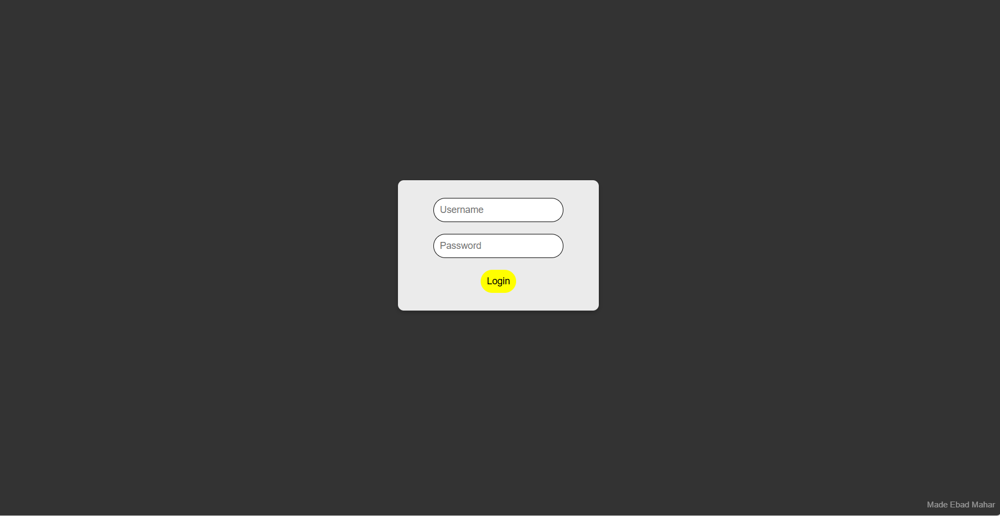
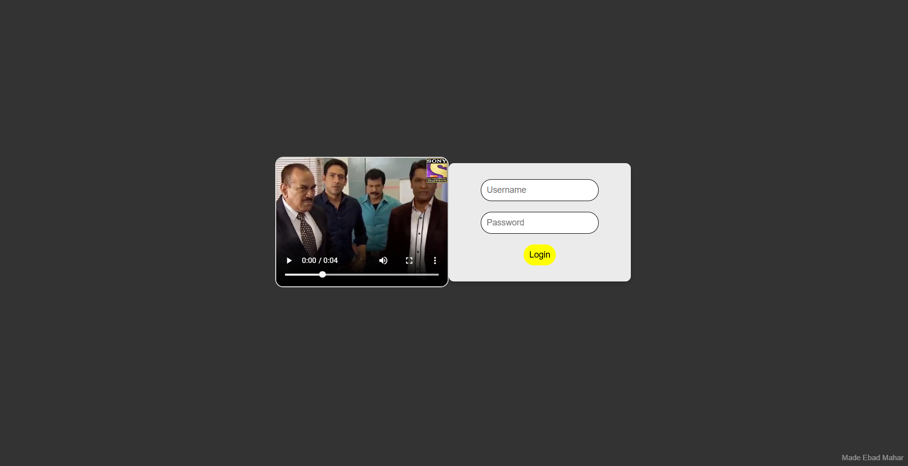
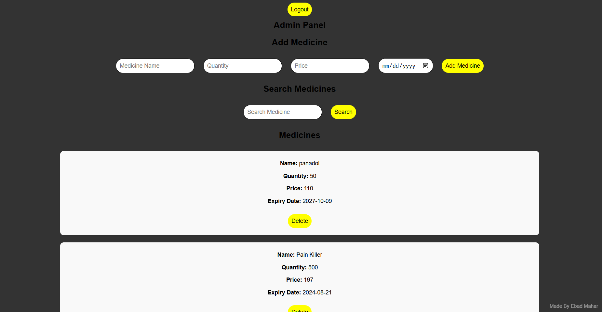
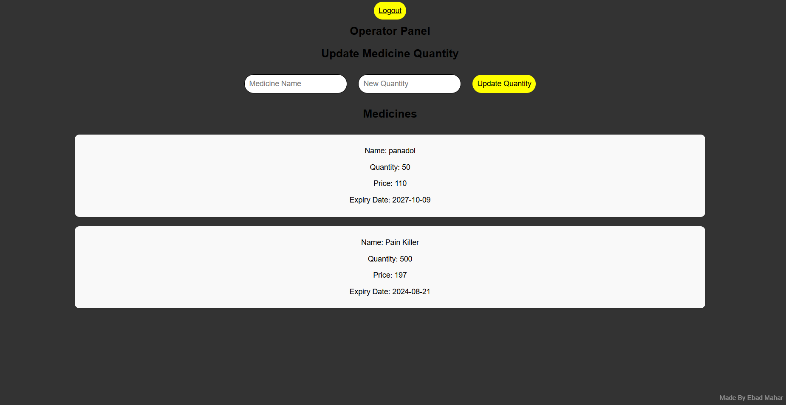

# Pharmacy Program

A web application for managing a pharmacy and doctor's office. This application includes a basic UI with a backend panel for admin and operator roles, written in Python using Flask. Demo Images Are Given Below.

## Features

- **Admin Panel**: Admin can log in, manage medicines, and perform administrative tasks.
- **Operator Panel**: Operator can log in, view medicine details, and update quantities.
- **Authentication**: Default credentials for admin and operator roles.
- **Secret Key**: Required for session management, generated via a Python script.
- **Warning Video**: Plays if incorrect login credentials are entered.

## Installation

1. **Clone the Repository:**

    ```sh
    git clone https://github.com/ebadmahar/Web-application-For-Pharmacy-Management-using-Python.git
    cd Web-application-For-Pharmacy-Management-using-Python
    ```

2. **Create a Virtual Environment:**

    ```sh
    python -m venv venv
    ```

3. **Activate the Virtual Environment:**

    - On Windows:

      ```sh
      venv\Scripts\activate
      ```

    - On macOS/Linux:

      ```sh
      source venv/bin/activate
      ```

4. **Install Dependencies:**

    ```sh
    pip install -r requirements.txt
    ```

5. **Generate a Secret Key:**

    Run the `temp.py` script to generate a secret key.

    ```sh
    python temp.py
    ```

    Copy the generated key and use it as needed in your configuration.

## Default Credentials

- **Admin Username**: `admin`
- **Admin Password**: `12345678`

- **Operator Username**: `operator`
- **Operator Password**: `12345678`

## Running the Application

To start the application, run:

```sh
python app.py
```
## Error Handling
**If incorrect login credentials are provided, a warning video (wrong.mp4) located in the static folder will be played.** 

## Customization
**You can change the default credentials and configure the application according to your needs. Replace or update the images and other static files as necessary.**

## Images





